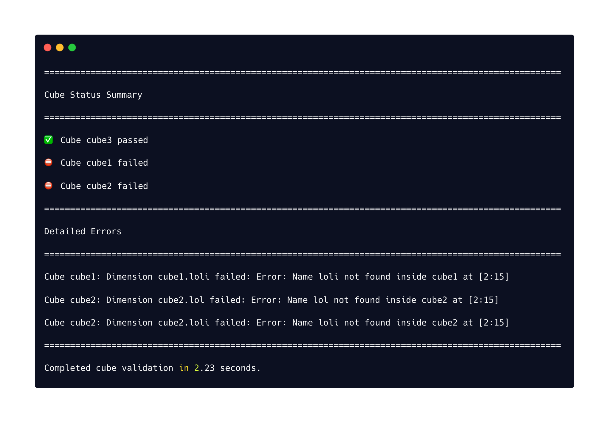

# Cube Guardian
 A Python package for [cube](https://cube.dev/) validation and testing.

## Why this project was created
- `The Challenge`: Manual Cube validation methods are often slow and unscalable, leading to inefficiencies and errors in data-rich environments.  
- `Our Solution`: Cube Guardian automates validation, using asynchronous programming for speed and efficiency.
- `Use Cases`: Essential for data analysts and engineers in large-scale data warehouses needing accurate, consistent validation.  
- `Vision`: Aiming to evolve Cube Guardian into a tool adept at complex validations, enhancing data analysis reliability.
- `Invitation`: Feedback and contributions are welcomed to help improve and expand Cube Guardian.

### Getting Started
To get started with Cube Guardian, you'll need to clone the GitHub repository to your local machine.  
Open your terminal and navigate to the directory where you want to store the Cube Guardian project.  
Then, run the following command:
```bash
git clone https://github.com/mchl-schrdng/cubeguardian.git
```

#### Config.yaml
To use Cube Guardian, you need to create a config.yaml file.  
This file stores essential configuration settings required for the application to function correctly.  
Example Configuration:
```bash
api_url: "https://example-api-url.com"
api_token: "your_api_token_here"
```

#### Usage
Cube Guardian can be run using the following command:
```bash
python cubeguardian.py [options]
```

Options:
- `--fail-fast`: Enable fail-fast mode. Stops testing further dimensions on the first failure.
- `--cubes cube1 cube2`: Specify a list of cube names to test.
- `--concurrency N`: Set the concurrency limit for testing (default is 10).
Example usage:
```bash
python cubeguardian.py --fail-fast --cubes cube1 cube2 --concurrency 5
```

#### Results
Below is a screenshot of the Cube Guardian in action, showing the output of a typical run:


This screenshot demonstrates the output provided by Cube Guardian when running tests.

#### License
This project is licensed under the MIT License, see the [LICENSE](https://github.com/mchl-schrdng/cubeguardian/blob/main/LICENSE.md) file for details.
